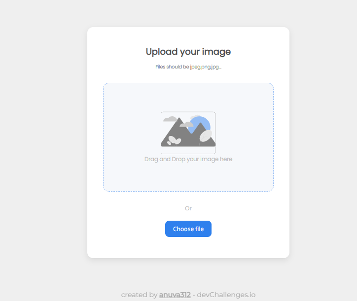
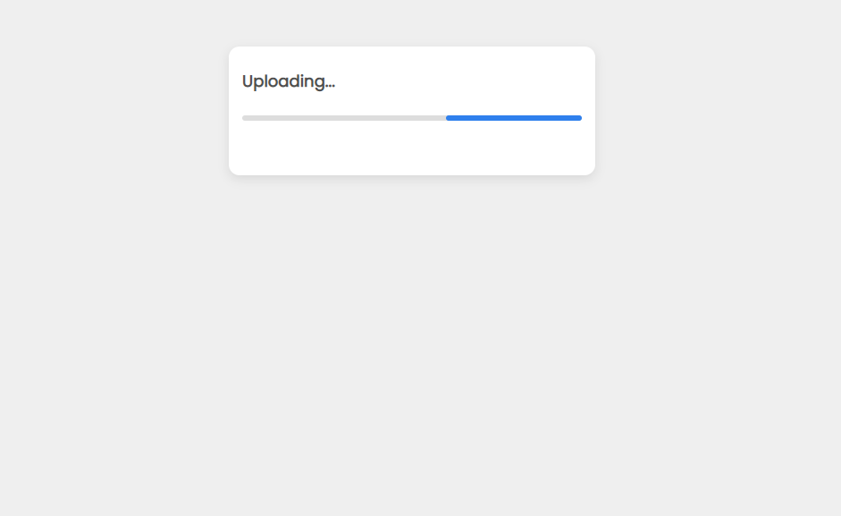
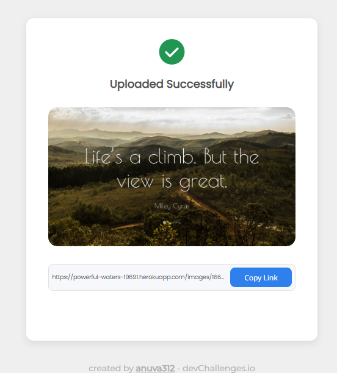

# Image Uploader

Solution to the [Image Uploader Challenge](https://legacy.devchallenges.io/challenges/O2iGT9yBd6xZBrOcVirx) from [Devchallenges.io](https://legacy.devchallenges.io/).

<!-- TABLE OF CONTENTS -->

## Table of Contents

- [Challenge](#challenge)
- [Solution](#solution)
  - [Demo](#demo)
  - [Demo Screenshots](#demo-screenshots)
  - [Built With](#built-with)
- [API Documentation](#api-documentation)
- [How to Use](#how-to-use)
- [Acknowledgements](#acknowledgements)

<!-- Challenge -->

## Challenge

Challenge: Create an Image Uploader application. Use any front-end libraries of your choice. Create your API. Don’t look at the existing solution.

Fulfill user stories below:

- User story: I can drag and drop an image to upload it
- User story: I can choose to select an image from my folder
- User story: I can see a loader when uploading
- User story: When the image is uploaded, I can see the image and copy it
- User story: I can choose to copy to the clipboard

## Solution

### Demo

Find the website in action [here](https://master--exquisite-heliotrope-34a798.netlify.app/)!

### Demo Screenshots

_*Home Page*_



_*File is being uploaded*_



_*Image Uploaded Successfully*_



### Built With

<!-- This section should list any major frameworks that you built your project using. Here are a few examples.-->

- [Node JS](https://nodejs.org/en/)
- [React](https://reactjs.org/)
- [Mongoose](https://mongoosejs.com/)

## API Documentation

Find the API Documentation in detail in the wiki [here](https://github.com/anuva312/ImageUploader-devChallenges/wiki).

### Domain URL

    https://anuva-image-uploader.onrender.com

_**Note** : Since I am using a free plan, the server goes to sleep after 15 min of inactivity and there will be a 30 sec delay for the server to wake up after it receives the first request. So if you don't get any response in the first try, please try again._

### Available APIs

| API                                                                                                         | Method | Endpoint            |
| ----------------------------------------------------------------------------------------------------------- | ------ | ------------------- |
| [Get All Images](https://github.com/anuva312/ImageUploader-devChallenges/wiki/Get-All-Images)               | GET    | /api/v1/images      |
| [Get An Image By Id](https://github.com/anuva312/ImageUploader-devChallenges/wiki/Get-An-Image-By-Id)       | GET    | /api/v1/images/{id} |
| [Get A Static File](https://github.com/anuva312/ImageUploader-devChallenges/wiki/Get-A-Static-File)         | GET    | /{path to file}     |
| [Upload An Image](https://github.com/anuva312/ImageUploader-devChallenges/wiki/Upload-An-Image)             | POST   | /api/v1/images      |
| [Delete All Images](https://github.com/anuva312/ImageUploader-devChallenges/wiki/Delete-All-Images)         | DELETE | /api/v1/images      |
| [Delete An Image By Id](https://github.com/anuva312/ImageUploader-devChallenges/wiki/Delete-An-Image-By-Id) | DELETE | /api/v1/images/{id} |

## How To Use

<!-- For example: -->

To clone and run this application, you'll need [Git](https://git-scm.com) and [npm](https://www.npmjs.com/). From your command line:

```bash
# Clone this repository
$ git clone "https://github.com/anuva312/ImageUploader-devChallenges"

# Install dependencies
$ npm install

# Run the app
$ npm run start
```

## Acknowledgements

- [Node.js, Express, MongoDB & More: The Complete Bootcamp 2022](https://www.udemy.com/course/nodejs-express-mongodb-bootcamp/)
- [How to Upload Images in Your Node.js App?](https://javascript.plainenglish.io/upload-images-in-your-node-app-e05d0423fd4a)
- [How to connect Node.js with React.js?](https://www.geeksforgeeks.org/how-to-connect-node-js-with-react-js/)
- [How to Implement the Drag-and-Drop of Files in React](https://betterprogramming.pub/how-to-implement-files-drag-and-drop-in-react-22cf42b7a7ef)
- [Documentation for file input](https://developer.mozilla.org/en-US/docs/Web/HTML/Element/input/file)
- [How to create a Loader](https://www.w3schools.com/howto/howto_css_loader.asp)
- [Line Loading Animation](https://codepen.io/ziafatali/pen/mxVwpq)
